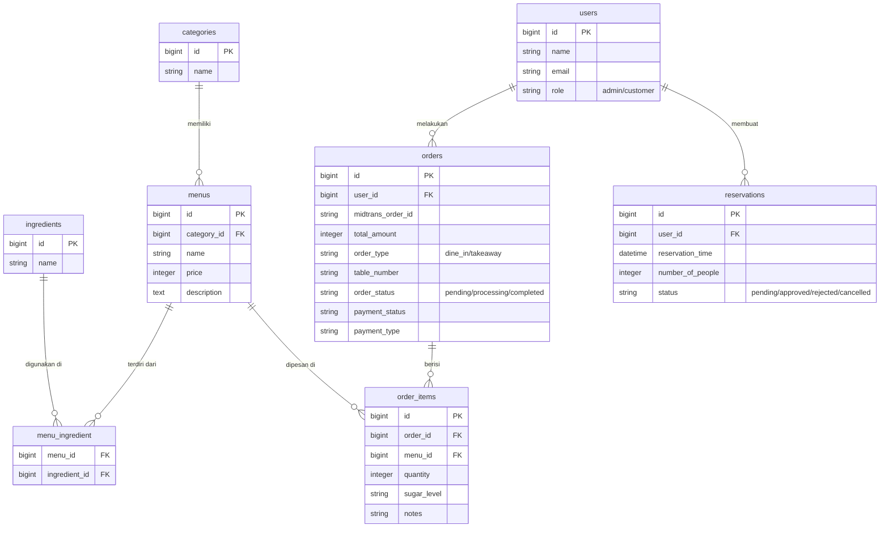

# Cafe Taraka - Sistem Manajemen & Pemesanan Cafe

Cafe Taraka adalah aplikasi **manajemen pesanan dan operasional cafe berbasis web** yang dibangun menggunakan **Tech Stack VILT (Vue.js, Inertia.js, Laravel, Tailwind CSS)**.
Aplikasi ini ditujukan untuk mempermudah pelanggan dalam memesan makanan (Dine-in & Takeaway), melakukan reservasi meja, bertanya pada AI Assistant, serta mempermudah Admin dalam mengelola pesanan, menu, dan operasional cafe secara terintegrasi.

---

## ✨ Fitur Utama

🔒 **Autentikasi & Keamanan**
- Login Admin dan Customer
- Enkripsi password dan perlindungan rute menggunakan Middleware (Inertia & Laravel)

📦 **Manajemen Data Master (Admin)**
- Manajemen Kategori & Menu (Harga, gambar, level gula, dll)
- Manajemen Bahan Baku (Ingredients) & Alergen
- Cetak QR Code Meja untuk pelanggan
- Kustomisasi Tema Website (Warna utama & aksen)

🛒 **Pemesanan & Pembayaran (Customer)**
- Pemesanan Menu dengan Opsi Dine-In & Takeaway
- Integrasi Payment Gateway **Midtrans** (QRIS, GoPay, Transfer Bank, dll)
- Riwayat Pesanan dan Status Real-time (Pending, Diproses, Selesai)
- Reservasi Meja secara online

🤖 **Asisten AI Terintegrasi**
- **AI Chatbot:** Asisten cerdas untuk menjawab pertanyaan seputar cafe dan menu.
- **AI Menu Contextual:** Membantu pelanggan mengecek detail alergen dan bahan baku pada menu tertentu.

---

## 🧱 Tech Stack

- **Backend**: Laravel 11 (PHP 8.2+)
- **Frontend**: Vue.js 3, Inertia.js
- **Styling**: Tailwind CSS
- **Database**: MySQL / SQLite
- **Payment Gateway**: Midtrans
- **Server lokal**: Laragon / XAMPP

---

## 📂 Struktur Folder & Arsitektur

Aplikasi ini menggunakan arsitektur monolitik modern yang digerakkan oleh **Inertia.js**, menghubungkan backend Laravel langsung dengan frontend Vue.js tanpa perlu membuat API manual untuk rendering halaman.

<details>
<summary>▶ Klik untuk melihat Struktur Folder Lengkap</summary>

```text
taraka-vilt/
├── app/
│   ├── Ai/           # Logika AI Assistant (MenuAssistantAgent)
│   ├── Http/
│   │   ├── Controllers/  # Controller terpisah untuk Admin, Customer, & API
│   │   └── Middleware/
│   └── Models/       # Model Eloquent (User, Menu, Order, dll)
├── database/
│   ├── migrations/   # Skema database
│   └── seeders/      # Data awal (Dummy)
├── public/           # File statis dan build Vite
├── resources/
│   ├── css/          # Tailwind setup
│   ├── js/
│   │   ├── Pages/    # Halaman Vue (Admin & Customer)
│   │   ├── shared/   # Layouts dan composables
│   │   └── widgets/  # Komponen UI yang dapat digunakan kembali
│   └── views/        # app.blade.php (Entry point Inertia)
└── routes/
    ├── web.php       # Rute utama (Inertia)
    └── api.php       # Rute API (AI Chat, Midtrans Webhook)
```
</details>

---

## 🗄️ Struktur Database (Inti)

Tabel utama:
- `users`: Data autentikasi pelanggan dan admin
- `categories`: Kategori menu (Makanan, Minuman, dll)
- `menus`: Data utama produk menu cafe
- `ingredients`: Data bahan baku menu untuk referensi alergi
- `orders`: Transaksi pemesanan oleh pelanggan
- `order_items`: Detail item pesanan dari sebuah transaksi
- `reservations`: Data pemesanan / booking meja
- `agent_conversations`: Riwayat obrolan AI dengan pelanggan
- `themes`: Pengaturan warna tema UI Cafe

---

## 📊 Skema Database (ERD)

Berikut adalah ringkasan struktur relasi database aplikasi Cafe Taraka:



---

## ⚙️ Instalasi Lokal

1. **Clone repository ini:**
   ```bash
   git clone https://github.com/voltakits725/taraka-vilt.git
   ```
2. **Masuk ke folder project & Install dependencies:**
   ```bash
   cd taraka-vilt
   composer install
   npm install
   ```
3. **Setup File Environment:**
   - Duplikat file `.env.example` dan ubah namanya menjadi `.env`.
   - Sesuaikan konfigurasi database (DB_CONNECTION, DB_DATABASE, dll).
   - Isi kredensial Midtrans (`MIDTRANS_SERVER_KEY`, `MIDTRANS_CLIENT_KEY`).
   - Isi API Key AI (Misalnya Gemini/OpenAI).
4. **Generate App Key & Database:**
   ```bash
   php artisan key:generate
   php artisan migrate --seed
   ```
5. **Jalankan Aplikasi:**
   - Jalankan backend Laravel:
     ```bash
     php artisan serve
     ```
   - Jalankan frontend Vite:
     ```bash
     npm run dev
     ```
   - Buka browser dan akses `http://localhost:8000`.
